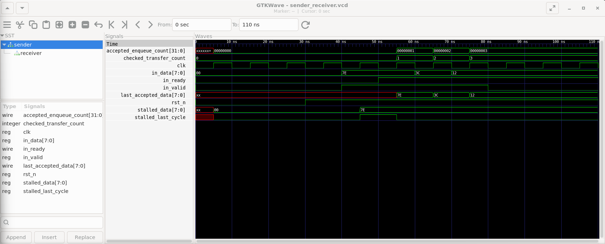

# Design Verification Portfolio

A reproducible SystemVerilog ready/valid verification lab with directed fault injection and waveform evidence.

> **Status:** the ready/valid lab is executable and checked. Synchronous FIFO design is in progress and is not a completed RTL deliverable. No Universal Verification Methodology (UVM) environment or functional-coverage closure is claimed.

## Delivered: ready/valid handshake lab

An 8-bit sender transfers `7E → 3C → 12` to a simulation-only receiver. Transfers are accepted on rising clock edges when `in_valid && in_ready`. Initial backpressure delays the first acceptance until 55 ns.

The receiver counts accepted transfers and retains the most recently accepted data. **It is not a First-In, First-Out (FIFO) buffer**: it has no queue, dequeue interface, or capacity management.

Verification includes:

- Ordered comparison of every accepted input against an independently initialized expected sequence
- Checks that valid and data remain stable after a sampled stall, including the accepting edge
- Independent receiver and checker counts
- A 200 ns simulation watchdog
- Four deliberately faulty scenarios that demonstrate checker sensitivity

## Reproduce

Requirements: Python 3 and Icarus Verilog (`iverilog` and `vvp`) on the executable search path. The runner uses only Python's standard library; cocotb, Make, and UVM are not required.

From the repository root on Linux / Windows Subsystem for Linux (WSL):

```bash
python3 scripts/run_handshake_lab.py
```

Expected summary:

```text
PASS normal: PASS
PASS sequence_mismatch: EXPECTED FAILURE detected
PASS valid_drop: EXPECTED FAILURE detected
PASS stalled_data_change: EXPECTED FAILURE detected
PASS timeout: EXPECTED FAILURE detected
SUMMARY: 5/5 scenarios matched their expected outcomes
```

A negative scenario passes the runner only when compilation succeeds, simulation exits unsuccessfully, and the expected diagnostic and simulation time are observed. Faults are applied to temporary copies, not to checked-in source.

Inspect the normal waveform:

```bash
gtkwave build/handshake-lab/normal.vcd &
```

For Windows PowerShell with simulator tools on the search path:

```powershell
python scripts/run_handshake_lab.py
```

If necessary, provide executable paths using `--iverilog` and `--vvp`.

## Selected evidence



The single screenshot shows the normal run: data is held during backpressure, then accepted at 55, 65, and 75 ns; both counters finish at 3. It contains only project waveform content. It is explanatory evidence, not a substitute for rerunning the source.

| Scenario | Expected result |
| --- | --- |
| Normal sequence | PASS; 3 accepted and checked transfers; finish at 110 ns |
| Second input changed to `3D` | Sequence mismatch at 65 ns |
| Valid withdrawn before first acceptance | Protocol violation at 55 ns |
| Data changed before first acceptance | Protocol violation at 55 ns |
| Receiver permanently not ready | Timeout at 200 ns |

See [verification results and limitations](results/ready-valid-results.md).

## Project boundaries

Checks are procedural SystemVerilog checks, not concurrent SystemVerilog Assertions (SVA). Data stability is checked at rising edges, not for between-edge glitches. The receiver stall schedule is fixed to this example's 10 ns clock. Passing these directed cases does not establish FIFO correctness, exhaustive protocol verification, synthesis readiness, or interview readiness.

The synchronous FIFO remains a separate, unfinished design. FIFO boundary, wraparound, simultaneous enqueue/dequeue, parameterization, and output-ordering results will be published only with executable evidence.

## Repository map

```text
examples/ready-valid/       Sender, receiver stub, and procedural checks
scripts/run_handshake_lab.py
                           Reproducible normal and negative scenario runner
results/                   Results summary and one selected waveform image
rtl/, tb/                  Reserved for the separate FIFO deliverable
```

## Provenance and confidentiality

This is a personal project created independently of employer systems and data, with AI-assisted coaching and packaging. The sender/checker work was developed interactively; the Python regression runner was added with AI assistance for reproducible publication.

No employer material, personal study schedule, interview-readiness rubric, credentials, machine identifiers, or private coaching notes are included in the published artifacts.
